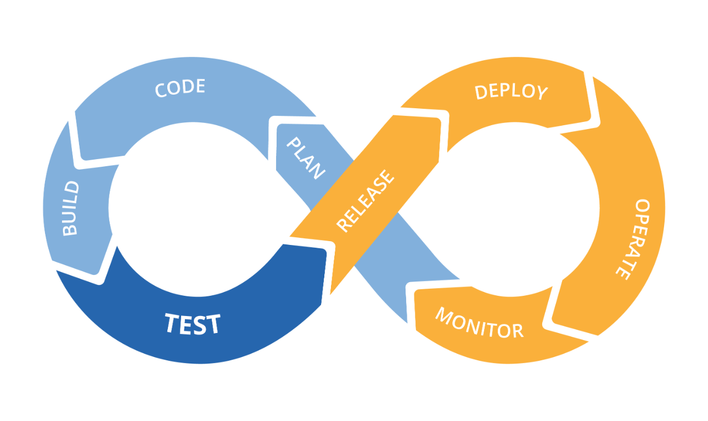
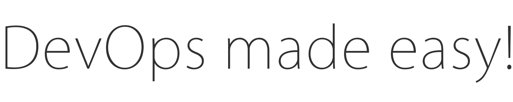

# DevOps Made Easy

This repository has tutorials, examples, and automation code for various DevOps tools and technologies.

## Examples

{:height="20px" width="20px"} [AWS](https://github.com/rathi-prashant/awesome_devops_examples/tree/master/aws)  
{:height="20px" width="20px"} [Azure](https://github.com/rathi-prashant/awesome_devops_examples/tree/master/azure)  
{:height="20px" width="20px"} [GCP](https://github.com/rathi-prashant/awesome_devops_examples/tree/master/gcp)   
{:height="20px" width="20px"} [Kubernetes](https://github.com/rathi-prashant/awesome_devops_examples/tree/master/kubernetes)   
{:height="20px" width="20px"} [Security](https://github.com/rathi-prashant/awesome_devops_examples/tree/master/security)    
{:height="20px" width="20px"} [Terraform](https://github.com/rathi-prashant/awesome_devops_examples/tree/master/terraform)   
{:height="20px" width="20px"} [Ansible](https://github.com/rathi-prashant/awesome_devops_examples/tree/master/ansible)  
{:height="20px" width="20px"} [Python](https://github.com/rathi-prashant/awesome_devops_examples/tree/master/python)    
{:height="20px" width="20px"} [Bash](https://github.com/rathi-prashant/awesome_devops_examples/tree/master/bash)  

 

## Demystify DevOps

| Component   | Tools       | Description |
| ----------- | ----------- | ----------- |
| SCM         | Github      |     text    |
|             | Bitbucket   |     text    |

## License

This project is licensed under the MIT License - see the [LICENSE.md](https://github.com/rathi-prashant/awesome_devops_examples/blob/master/docs/LICENSE.md) file for details

# TO-DO - Use buddy https://buddy.works/pricing
